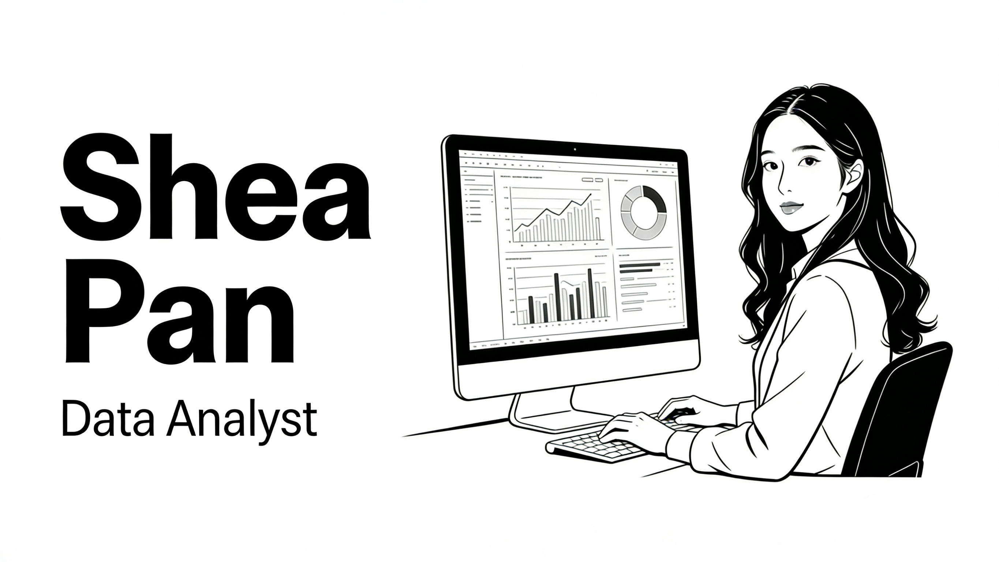

## Hi, I'm Shea 👋

I’m a **data analyst** driven by a passion for turning raw data into **meaningful insights** that shape **business strategy**. 

Over the past **four years**, I’ve led cross-industry projects in **user behaviour analysis**, **ad performance tracking**, and **inventory modelling**, delivering results such as a **113% increase** in followers and an **80% reduction in waste**. 

I recently completed the Generation UK & Ireland Data Analytics programme, gaining hands-on experience across the full analytics workflow—from **data cleaning, transformation, exploratory analysis and data visualisation** to presentation—using **Excel, SQL, Python, and Power BI**. Combining technical skills with strong communication abilities, I translate complex findings into clear, actionable recommendations. As I move into a data-focused role, I’m eager to continue growing, learning, and applying an **analytical, curious, and adaptable mindset** to deliver impact through evidence-based strategies.

## Key Skills

- 📊 **Data Analysis** — Solving business problems through data manipulation using Excel, SQL, and Python  
- 📈 **Data Visualisation** — Creating interactive dashboards and insightful reports with Power BI, Tableau, and Excel  
- 🖥️ **Microsoft Office** — Advanced Excel, Word, PowerPoint; certified in Microsoft PL-900  
- 🔍 **Marketing Research** — Collecting and interpreting market data to uncover consumer insights  
- 🗣️ **Communication** — Strong presentation and collaboration skills across B2B and B2C contexts  
- 🚀 **Proactivity** — Self-driven learner actively seeking solutions and improving technical skills  
- 🌍 **Bilingual** — Fluent in English and Chinese (Mandarin)

## Find me here:
- [LinkedIn](https://www.linkedin.com/in/shea-pan/) 💼
- [Portfolio](https://www.notion.so/Hey-there-I-am-Shea-2aadadd782fa80f590f8eca769036b72?source=copy_link)
